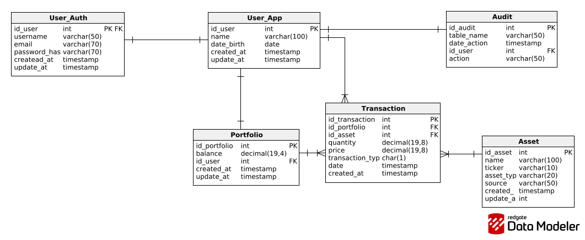

# Portfolio Tracker

Aplicación full stack para el seguimiento de un portfolio de inversiones (acciones y criptomonedas), con cálculo de ganancia/pérdida en base a precios de mercado en tiempo real.

Proyecto desarrollado con fines de aprendizaje y portfolio técnico, con foco en buenas prácticas de arquitectura, seguridad y testing sobre un dominio fintech.

---

## Stack técnico

| Capa | Tecnología |
|---|---|
| Backend | Spring Boot 4.1.1, Java 21 |
| Persistencia | Spring Data JPA + Hibernate, PostgreSQL 16 |
| Migraciones | Flyway |
| Seguridad | Spring Security + JWT (jjwt) |
| Frontend | React + TypeScript *(en desarrollo)* |
| Contenedores | Docker Compose |
| Testing de API | Postman |

---

## Esquema de la base de datos



*(Diagrama generado con Redgate Data Modeler. Ver `docs/db-schema.png` — reemplazar con la versión más actualizada del modelo si cambia.)*

---

## Cómo levantar el proyecto localmente

### Requisitos previos
- Java 21 (JDK)
- Docker y Docker Compose
- Maven (o usar el wrapper `./mvnw` incluido en el proyecto)

### Pasos

1. **Cloná el repositorio**
   ```bash
   git clone <url-del-repo>
   cd portfolio-tracker
   ```

2. **Configurá las variables de entorno**

   Copiá el archivo de ejemplo y completá con tus propios valores:
   ```bash
   cp .env.example .env
   ```
   Editá `.env` con tus credenciales locales (usuario/password de la base, secreto de JWT, API keys de servicios externos si aplica).

3. **Levantá la base de datos con Docker**
   ```bash
   docker compose up -d
   ```
   Esto inicia PostgreSQL en el puerto `5432`. Las migraciones de Flyway se aplican automáticamente al levantar el backend.

4. **Corré el backend**
   ```bash
   ./mvnw spring-boot:run
   ```
   La API queda disponible en `http://localhost:8080`.

5. **(Cuando esté disponible) Corré el frontend**
   ```bash
   cd frontend
   npm install
   npm run dev
   ```

---

## Endpoints disponibles

### Autenticación (`/v1/api/auth`)

| Método | Endpoint | Descripción | Acceso |
|---|---|---|---|
| `POST` | `/v1/api/auth/register` | Registra un nuevo usuario (crea `UserApp`, `UserAuth` y un `Portfolio` inicial en balance 0) | Público |
| `POST` | `/v1/api/auth/login` | Autentica un usuario y devuelve un JWT | Público |
| `GET` | `/v1/api/auth/me` | Devuelve el usuario autenticado actual | Requiere token |

**Ejemplo — Registro:**
```http
POST /v1/api/auth/register
Content-Type: application/json

{
  "name": "Juan Pérez",
  "dateBirth": "1995-03-14",
  "username": "juanp",
  "email": "juan@example.com",
  "password": "unaPasswordSegura123"
}
```

**Respuesta:**
```json
{
  "username": "juanp",
  "token": "eyJhbGciOiJIUzI1NiJ9..."
}
```

Para el resto de las rutas protegidas, incluir el token en el header:
```
Authorization: Bearer <token>
```

> Documentación interactiva completa disponible vía Swagger en `/swagger-ui.html` *(pendiente de configurar)*.

---


## Estado del proyecto

Desarrollo organizado en sprints semanales (3hs/día, L-V).

- [x] **Épica 1 — Autenticación y usuarios**
  Registro, login, JWT, hasheo de passwords, manejo de excepciones (401/403/409/400), filtro de autenticación con validación de tokens (expirados, malformados, firma inválida).
- [ ] **Épica 2 — Gestión de posiciones**
  CRUD de `Portfolio` y `Asset`, primera ruta protegida con lógica de negocio.
- [ ] **Épica 3 — Integración de precios externos**
  Consumo de API de precios (acciones/cripto), actualización periódica.
- [ ] **Épica 4 — Cálculo y visualización**
  Ganancia/pérdida, dashboard, gráficos.
- [ ] **Épica 5 — Calidad y despliegue**
  Tests automatizados, triggers de auditoría en PL/pgSQL, Swagger, deploy.

---

## Arquitectura del backend

Organización híbrida: capas técnicas generales (`controller/`, `service/`, `repository/`, `dto/`, `mapper/`, `entity/`) más un módulo por feature para autenticación (`auth/`), dado su alcance transversal y autocontenido.

```
src/main/java/org/portfoliotracker/portfolio/
├── auth/           # UserAuth, JWT, filtro, service y controller de autenticación
├── config/         # SecurityConfig, ApplicationConfig (beans de infraestructura)
├── controller/
├── service/
├── repository/
├── dto/
│   ├── request/
│   └── response/
├── mapper/
├── entity/
└── exception/      # GlobalExceptionHandler y excepciones genéricas
```

---

## Seguridad

- Passwords hasheadas con BCrypt, nunca almacenadas en texto plano.
- Autenticación stateless vía JWT (sin sesiones ni cookies).
- Variables sensibles gestionadas por entorno (`.env`, nunca commiteado — ver `.gitignore`).
- Mensajes de error de login genéricos, para no filtrar si un username existe o no.